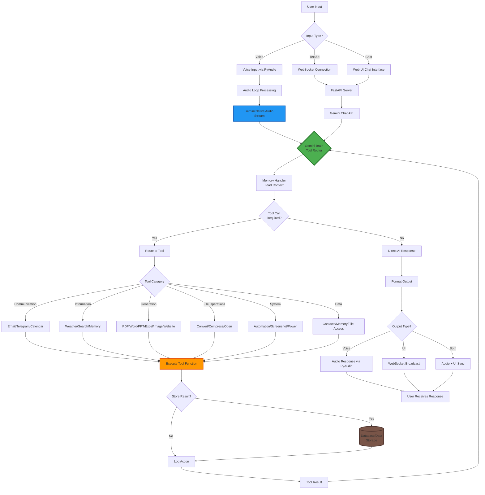
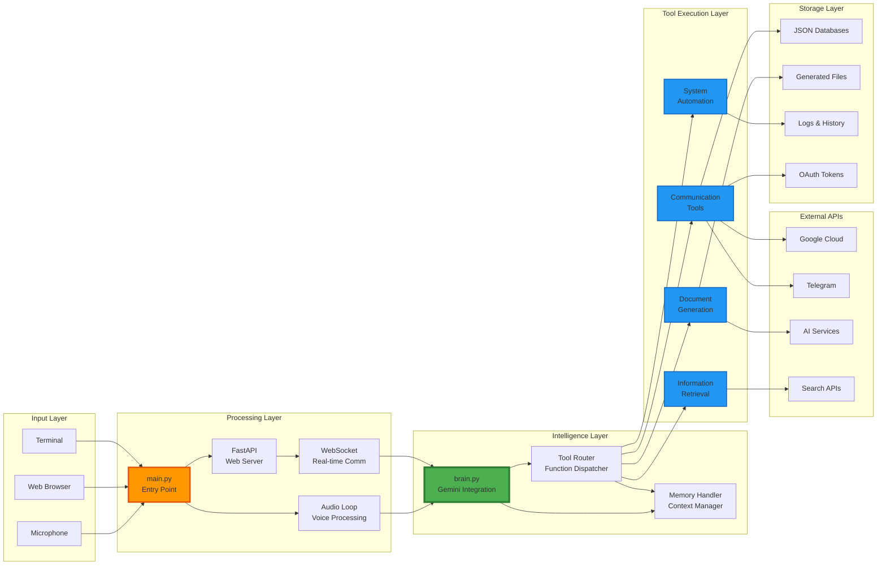
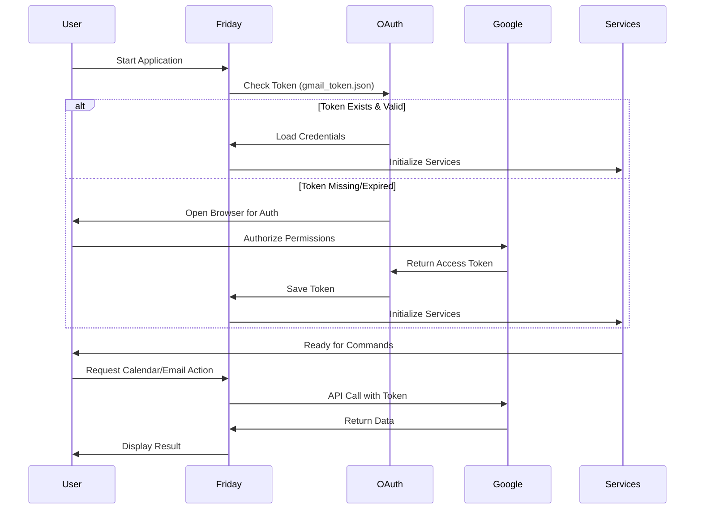
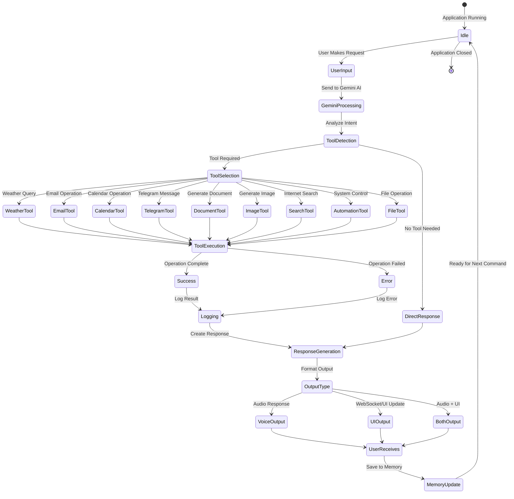
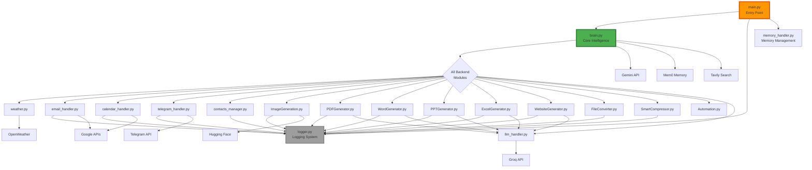
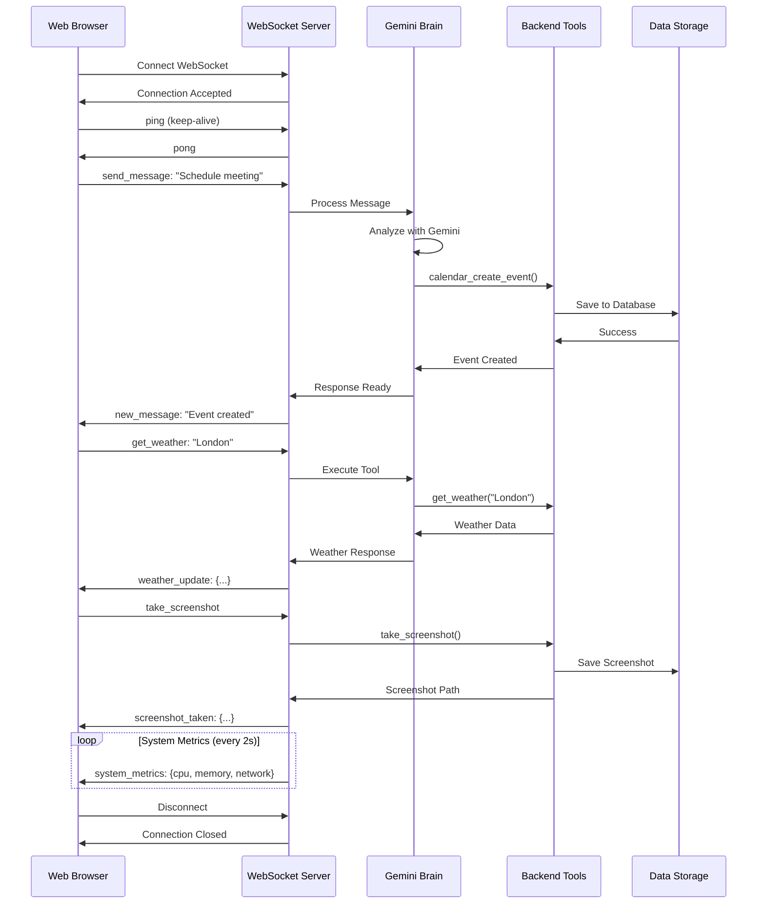

# Friday AI Assistant - Complete Architecture Flowchart

## High-Level Architecture Diagram

```mermaid
graph TB
    subgraph "User Interface Layer"
        A1[Voice Input - Microphone]
        A2[Web UI - React/Next.js]
        A3[Text Input - Chat]
    end

    subgraph "Main Application - main.py"
        B1[Audio Loop - PyAudio]
        B2[FastAPI Server]
        B3[WebSocket Manager]
        B4[System Metrics Monitor]
    end

    subgraph "Core Intelligence - brain.py"
        C1[Gemini Brain]
        C2[Tool Router]
        C3[Function Executor]
        C4[Memory Context Handler]
    end

    subgraph "AI Models & APIs"
        D1[AI Model - Native Audio]
        D2[Groq API - Fallback LLM]
        D3[Mem0 - Long-term Memory]
        D4[Tavily - Internet Search]
    end

    subgraph "Backend Modules"
        E1[weather.py - Weather Tool]
        E2[email_handler.py - Gmail API]
        E3[calendar_handler.py - Calendar API]
        E4[telegram_handler.py - Telegram Bot]
        E5[contacts_manager.py - Contacts DB]
        E6[ImageGeneration.py - Stable Diffusion]
        E7[PDFGenerator.py - PDF Creation]
        E8[WordGenerator.py - Word Docs]
        E9[PPTGenerator.py - PowerPoint]
        E10[ExcelGenerator.py - Excel Sheets]
        E11[WebsiteGenerator.py - HTML Sites]
        E12[FileConverter.py - Format Conversion]
        E13[SmartCompressor.py - File Compression]
        E14[Automation.py - System Control]
        E15[logger.py - Logging System]
        E16[memory_handler.py - Memory Management]
        E17[llm_handler.py - LLM Management]
    end

    subgraph "Data Storage"
        F1[Database/chatlogs.json]
        F2[Database/contacts.json]
        F3[Database/gmail_token.json]
        F4[Database/credentials.json]
        F5[Data/GeneratedDocuments/]
        F6[Data/GeneratedImages/]
        F7[Data/GeneratedWebsites/]
        F8[Data/ConvertedDocuments/]
        F9[Database/TerminalLogs/]
    end

    subgraph "External Services"
        G1[Google Cloud APIs]
        G2[Telegram API]
        G3[Hugging Face API]
        G4[Tavily Search API]
        G5[OpenWeather API]
    end

    subgraph "Frontend - jarvis-ui/"
        H1[Next.js App Router]
        H2[React Components]
        H3[WebSocket Client]
        H4[Tailwind CSS Styling]
        H5[Dashboard]
        H6[Chat Interface]
        H7[Settings Page]
    end

    %% User to Main App
    A1 --> B1
    A2 --> B3
    A3 --> B3

    %% Main App to Brain
    B1 --> C1
    B2 --> C1
    B3 --> C1

    %% Brain to AI Models
    C1 --> D1
    C1 --> D2
    C1 --> D3
    C1 --> D4

    %% Brain to Tool Router
    C1 --> C2
    C2 --> C3
    C3 --> C4

    %% Tool Router to Backend Modules
    C3 --> E1
    C3 --> E2
    C3 --> E3
    C3 --> E4
    C3 --> E5
    C3 --> E6
    C3 --> E7
    C3 --> E8
    C3 --> E9
    C3 --> E10
    C3 --> E11
    C3 --> E12
    C3 --> E13
    C3 --> E14
    C3 --> E15
    C3 --> E16
    C3 --> E17

    %% Backend to Storage
    E2 --> F3
    E3 --> F3
    E5 --> F2
    E6 --> F6
    E7 --> F5
    E8 --> F5
    E9 --> F5
    E10 --> F5
    E11 --> F7
    E12 --> F8
    E15 --> F1
    E15 --> F9
    E16 --> F1

    %% Backend to External Services
    E1 --> G5
    E2 --> G1
    E3 --> G1
    E4 --> G2
    E6 --> G3
    D4 --> G4

    %% Frontend Components
    H1 --> H2
    H2 --> H3
    H2 --> H5
    H2 --> H6
    H2 --> H7
    H3 --> B3

    style C1 fill:#4CAF50,stroke:#2E7D32,stroke-width:3px
    style D1 fill:#2196F3,stroke:#1565C0,stroke-width:2px
    style B2 fill:#FF9800,stroke:#E65100,stroke-width:2px
    style H1 fill:#9C27B0,stroke:#6A1B9A,stroke-width:2px
```



## Detailed Component Flow



## Data Flow Architecture



## Authentication & Security Flow



## Tool Execution Flow



## Module Dependency Graph



## WebSocket Communication Flow



## File Generation Pipeline

```mermaid
flowchart TD
    START[User Request:<br/>"Generate X document on Y"] --> BRAIN[Gemini Brain<br/>Parse Request]
    
    BRAIN --> DETERMINE{Document<br/>Type?}
    
    DETERMINE -->|PDF| PDF_GEN[PDFGenerator.py]
    DETERMINE -->|Word| WORD_GEN[WordGenerator.py]
    DETERMINE -->|PowerPoint| PPT_GEN[PPTGenerator.py]
    DETERMINE -->|Excel| EXCEL_GEN[ExcelGenerator.py]
    DETERMINE -->|Website| WEB_GEN[WebsiteGenerator.py]
    DETERMINE -->|Image| IMG_GEN[ImageGeneration.py]
    
    PDF_GEN --> RESEARCH{Research<br/>Content?}
    WORD_GEN --> RESEARCH
    PPT_GEN --> RESEARCH
    EXCEL_GEN --> RESEARCH
    WEB_GEN --> RESEARCH
    
    RESEARCH -->|Yes| INTERNET[Internet Search<br/>via Tavily]
    RESEARCH -->|No| LLM[LLM Generation<br/>via Groq/Gemini]
    
    INTERNET --> LLM
    
    LLM --> FORMAT[Format Content<br/>for Document Type]
    
    FORMAT --> CREATE[Create Document<br/>with Libraries]
    
    CREATE --> LIBS{Library Used}
    
    LIBS -->|PDF| REPORTLAB[ReportLab]
    LIBS -->|Word| PYTHON_DOCX[python-docx]
    LIBS -->|PPT| PYTHON_PPTX[python-pptx]
    LIBS -->|Excel| OPENPYXL[openpyxl]
    LIBS -->|Website| HTML_GEN[HTML/CSS/JS]
    LIBS -->|Image| STABLE_DIFF[Stable Diffusion<br/>via Hugging Face]
    
    REPORTLAB --> SAVE[Save to Data/<br/>GeneratedDocuments/]
    PYTHON_DOCX --> SAVE
    PYTHON_PPTX --> SAVE
    OPENPYXL --> SAVE
    HTML_GEN --> SAVE_WEB[Save to Data/<br/>GeneratedWebsites/]
    STABLE_DIFF --> SAVE_IMG[Save to Data/<br/>GeneratedImages/]
    
    IMG_GEN --> STABLE_DIFF
    
    SAVE --> LOG[Log Generation]
    SAVE_WEB --> LOG
    SAVE_IMG --> LOG
    
    LOG --> RESPONSE[Return File Path<br/>to Brain]
    
    RESPONSE --> USER_ACTION{User<br/>Action?}
    
    USER_ACTION -->|Open| OPEN[Open with<br/>Default App]
    USER_ACTION -->|Send| SEND[Send via<br/>Email/Telegram]
    USER_ACTION -->|Convert| CONVERT[Convert Format]
    USER_ACTION -->|Compress| COMPRESS[Smart Compress]
    USER_ACTION -->|Done| COMPLETE[Complete]
    
    OPEN --> COMPLETE
    SEND --> COMPLETE
    CONVERT --> COMPLETE
    COMPRESS --> COMPLETE
    
    style BRAIN fill:#4CAF50,stroke:#2E7D32,stroke-width:3px
    style LLM fill:#2196F3,stroke:#1565C0,stroke-width:2px
    style SAVE fill:#795548,stroke:#4E342E,stroke-width:2px
```

---

## API Documentation

For comprehensive API documentation including all REST endpoints, WebSocket messages, and usage examples, see:

👉 **[API_DOCUMENTATION.md](API_DOCUMENTATION.md)**

Quick summary:
- **21+ REST API endpoints** for system control, file management, contacts, etc.
- **WebSocket API** for real-time bidirectional communication
- **Base URL:** `http://localhost:8000`
- **Framework:** FastAPI with async/await

## Key Architecture Principles

### 1. **Modular Design**
- Each backend module is self-contained
- Clear separation of concerns
- Easy to add new tools/features

### 2. **Unified Intelligence**
- Single Gemini Brain handles all routing
- Consistent tool calling interface
- Memory context shared across all operations

### 3. **Multi-Modal Input**
- Voice (PyAudio + Gemini Native Audio)
- Text (WebSocket + FastAPI)
- UI (React + Next.js)

### 4. **Shared Authentication**
- OAuth2 tokens shared across Google services
- Single authentication flow for Gmail + Calendar
- Secure token storage in Database/

### 5. **Real-Time Communication**
- WebSocket for instant UI updates
- Bi-directional data flow
- System metrics broadcasting

### 6. **Persistent Memory**
- Mem0 for long-term context
- JSON databases for contacts/chatlogs
- File system for generated content

### 7. **Error Resilience**
- Comprehensive logging
- API key rotation (15 Google + 10 Groq keys)
- Graceful degradation

### 8. **Extensibility**
- Easy to add new tools
- Plugin-like architecture
- Standardized tool interface

### 9. **RESTful & Real-time APIs**
- FastAPI for REST endpoints
- WebSocket for bidirectional communication
- CORS-enabled for frontend integration
- Comprehensive API documentation

---

**Generated:** January 11, 2026  
**Project:** Friday AI Assistant  
**Architecture Version:** 2.0  
**API Endpoints:** 21+ REST + WebSocket  
**Server:** FastAPI (port 8000)
