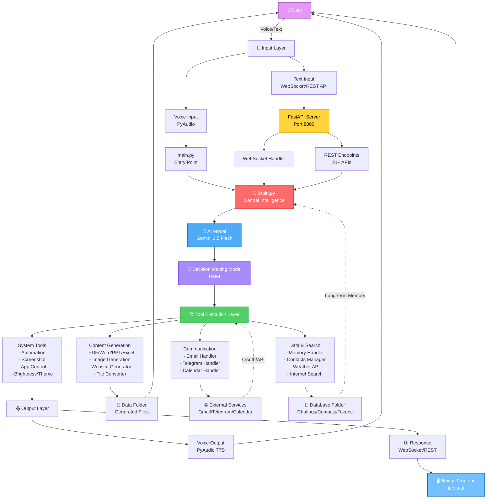
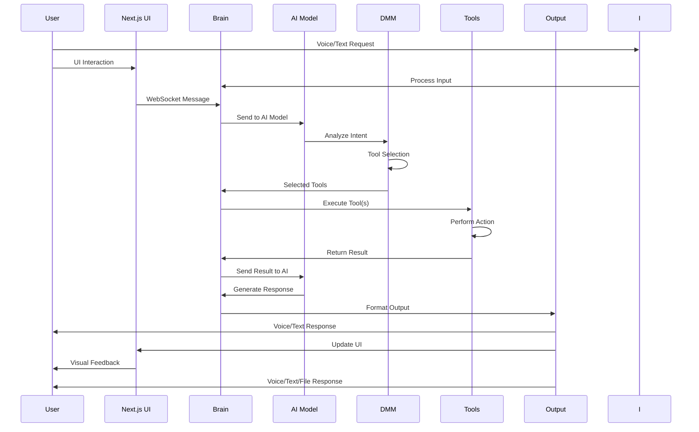

# Friday AI Assistant - Architecture Overview

## High-Level System Architecture



## System Flow Summary

### 1. **Input Layer**
- **Voice:** PyAudio captures audio → Native Audio API
- **Text:** WebSocket/REST API → FastAPI Server

### 2. **Processing Core**
- **main.py:** Entry point, initializes all handlers
- **AI Model:** Gemini 2.5 Flash for natural language processing
- **DMM (Decision Making Model):** Proprietary AI model for tool selection and routingng
- **Tool Selection:** AI decides which tools to execute

### 3. **Tool Execution Layer**
- **System Tools:** Automation, screenshot, app control, system settings
- **Content Generation:** PDF, Word, PPT, Excel, images, websites
- **Communication:** Email, Telegram, Google Calendar
- **Data & Search:** Memory, contacts, weather, internet search

### 4. **Output Layer**
- **Voice Output:** TTS via PyAudio
- **UI Response:** WebSocket/REST to Next.js frontend
- **File Generation:** Saved to Data folder
- **External Services:** Gmail, Telegram, Calendar APIs

### 5. **Storage & State**
- **Database Folder:** Chatlogs, contacts, OAuth tokens
- **Memory System:** Mem0 for long-term context
- **File System:** Generated content in Data folder

## Technology Stack

| Layer | Technology |
|-------|------------|
| **AI Model** | Gemini 2.5 Flash (Native Audio) |
| **Decision Engine** | DMM (Decision Making Model) - Proprietary |
| **Backend** | Python + FastAPI |
| **Frontend** | Next.js + React + TypeScript |
| **UI Framework** | shadcn/ui + Tailwind CSS |
| **Voice** | PyAudio (Input/Output) |
| **Memory** | Mem0 (Long-term) |
| **Database** | JSON files |
| **Communication** | WebSocket + REST API |
| **Authentication** | OAuth 2.0 (Google Services) |

## Data Flow



## Key Features

### 🎯 Core Capabilities
- **Voice Conversation:** Natural voice interaction with native audio processing
- **Tool Orchestration:** 50+ integrated tools for diverse tasks
- **Multi-Modal:** Text, voice, image, document generation
- **Real-time Communication:** WebSocket for instant updates
- **Long-term Memory:** Context retention across sessions

### 🔧 Tool Categories

1. **System Control** (8 tools)
   - Automation, screenshots, app management, system settings

2. **Content Generation** (10 tools)
   - Documents (PDF, Word, PPT, Excel), images, websites

3. **Communication** (6 tools)
   - Email, Telegram, Calendar (view, create, update, delete events)

4. **Data Management** (8 tools)
   - Memory, contacts, weather, internet search

5. **File Operations** (5 tools)
   - File conversion, compression, generation tracking

### 🌐 API Access
- **REST API:** 21+ endpoints for synchronous operations
- **WebSocket:** Real-time bidirectional communication
- **Frontend:** Next.js dashboard with live updates

## Architecture Principles

### ✅ Design Patterns
- **Modular Design:** Each tool is an independent handler
- **Central Router:** brain.py orchestrates all operations
- **Async Processing:** FastAPI with async/await
- **Stateless API:** RESTful design with token-based auth
- **Event-Driven:** WebSocket for real-time updates

### 🔒 Security
- **OAuth 2.0:** Google services authentication
- **Token Storage:** Secure credential management
- **Local-First:** No external data sharing
- **API Isolation:** CORS-protected endpoints

### 📊 Scalability
- **Async I/O:** Non-blocking operations
- **Modular Tools:** Easy to add new capabilities
- **Multiple API Keys:** 15 Google + 10 Groq slots
- **LoadDMM/               # Decision Making Model (AI)
│   │   ├── decision_model.py
│   │   ├── tool_classifier.py
│   │   ├── intent_analyzer.py
│   │   └── models/        # Trained model weights
│   ├── *_handler.py       # Tool handlers (email, calendar, memory, etc.)
│   └── *Generator.py      # Content generators (PDF, Word, PPT, etc.)
├── Database/              # Chatlogs, contacts, OAuth tokens
├── Data/                  # Generated files (PDF, images, websites)
└── jarvis-ui/            # Next.js frontend (shadcn/ui + Tailwind)
Friday2/
├── main.py                 # Entry point + FastAPI server
├── Backend/
│   ├── brain.py           # Central intelligence router
│   ├── *_handler.py       # Tool handlers (email, calendar, memory, etc.)
│   └── *Generator.py      # Content generators (PDF, Word, PPT, etc.)
├── Database/              # Chatlogs, contacts, OAuth tokens
├── Data/                  # Generated files (PDF, images, websites)
└── jarvis-ui/            # Next.js frontend
```

## Quick Links

- **Full Architecture:** [ARCHITECTURE_FLOWCHART.md](ARCHITECTURE_FLOWCHART.md)
- **API Documentation:** [API_DOCUMENTATION.md](API_DOCUMENTATION.md)
- **Calendar Integration:** [CALENDAR_INTEGRATION.md](CALENDAR_INTEGRATION.md)
- **Main Documentation:** [README.md](README.md)

---

**Last Updated:** January 11, 2026  
**Version:** 2.0  
**Status:** Production Ready
